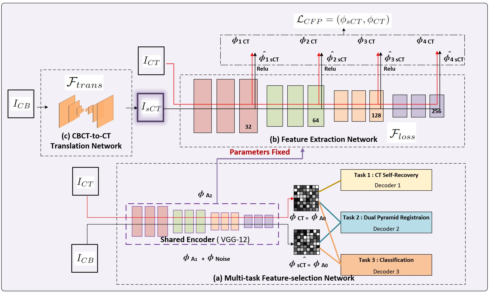

# CFP-Loss
Codes for the paper "Feature-oriented Deep Learning Framework for Pulmonary Cone-beam CT (CBCT) Enhancement with Multi-task Customized Perceptual Loss"

# Authors
Jiarui Zhu, Weixing Chen, Hongfei Sun, Shaohua Zhi, Jing Cai, and Ge Ren.

### 🛠 Requirements
- Python 3.7+
- PyTorch 1.11.0+
- 1 GPU: NVIDIA GeForce GTX 3090 (24GB) at least

> Fig. 1.  The overall architecture of our proposed framework.(a)indicates our multi-task feature-selection network (b)indicates our feature extraction network (c)indicates our CBCT-to-PlanCT translation network.

## Dataset

In this study, we utilized four-dimensional thoracic CBCT and PCT image pairs from 100 lung cancer patients who underwent stereotactic radiotherapy on a Varian Medical Systems (VISION 3253) machine between 2017-2019 at Queen Mary’s Hospital in Hong Kong. These 100 patients were randomly split 70/30 into AI-training and AI-testing groups, with the training dataset further split 56/14 for training and validation. 

Due to the hospital's confidential agreement, we cannot share real patient data at this moment. Yet we can provide a few demo patients in a later time, for convenient reproduction of our work.

## Preprocess 
1.Run [data/lungseg.py]("https://github.com/zhujiarui42/CPF-Loss/data/lungseg.py") to operate lung segmentation & cropping on CT/CBCT images.
2.Run [data/lnii2array.py]("https://github.com/zhujiarui42/CPF-Loss/data/nii2array.py") to do data resizing and nomarlization and transform preprocessed nii files to npy files, before feeding them into the network.

## Training
Read the training tutorial for details.
1. Train MTFS-Net: Our method requires a pretraining our the Multitask Feature-selection Network(MTFS-Net) and getting a parameters-fixed encoder first.
(You may check for more details about the MTFS-Net here: [MTFS-Net model]("https://github.com/zhujiarui42/CPF-Loss/models/MultitaskModels/MTFSnet.py"))
To train the MTFS-Net you can change args in [main.py]("https://github.com/zhujiarui42/CPF-Loss/main.py") and then run it. Remember to change the "--model" arg to "mtfsnet","-loss_fn" to "gradnorm" and the "--trainer" to "mtfsnet".
We've also provided a simpler way to run it on Linux system through bashing [task/mtfsnet.sh]("https://github.com/zhujiarui42/CPF-Loss/task/mtfsnet.sh"). Please remember to change our default conda environment path to your own path.

2. Train CBCT-CT transaltion Net : The pre-trained Encoder from MTFS-Net can be further used for building up a perceptual loss function. For building up a perceptual loss function, we've combined content and style loss and the final loss function is free to be further customized in line 269 of  [utils/loss.py](https://github.com/zhujiarui42/CPF-Loss/utils/loss.py). In our case, we've ultized the first two size-level (256 & 128)layers outputs of the pre-trained Encoder for content loss calculation and layer outputs of all the four size-levels for style loss calculation. And we set the weigh factors to be  0.5 and 0.5.
To train the CBCT-CT transaltion Net you can change args in [main.py]("https://github.com/zhujiarui42/CPF-Loss/main.py")and then run it. Remember to change the "--model" arg to "carunet" and "-loss_fn" to "CFP".
[task/unetCFP.sh]("https://github.com/zhujiarui42/CPF-Loss/task/mtfsnet.sh") was also provided for you convience.

3.  Comparison experiments. Unet/Resunet/CARUnet(channel attention resunet), gan/cyclegan models, and dual-pyramid registration network were also provided for comparison experiments. Secially for the SOTA method "CycleGAN", you may train a cyclegan model by changing the "--model"arg to "cyclegan" and the "--trainer" arg to "cyclegan". You can also compare a pixel-to-pixel loss version and a CFP loss version by changing the "--loss_fn" args to "mse"/"mix" or "CFP". 

Notes: You may also change the "--lr_scheduler","--batch_size","epochs",...etc accordling to your own research insterets. We've also proved more kinds of loss functions for comparasion.

## Evaluation
For evalution of trained models, you simply need to make some modifications in [main.py]("https://github.com/zhujiarui42/CPF-Loss/main.py"): 
1.uncomment line 85("model.load_state_dict(torch.load(f"output/{args.version}/model.npy")['state_dict'])") 
2.uncomment line 144("trainer.eval(True)")
3.comment line 143("trainer.train()").
